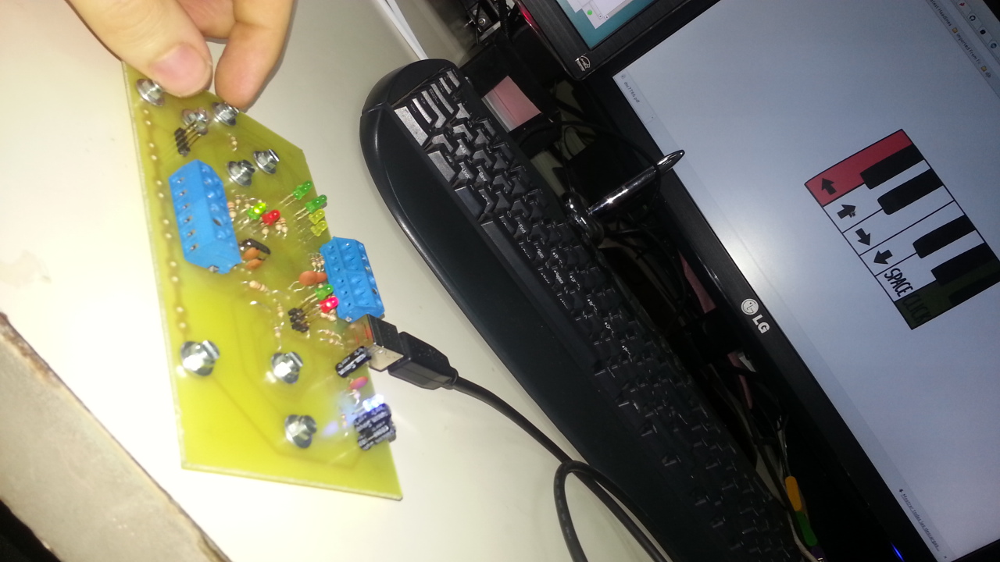

# Ajugar

 

Ajugar is an electronic circuit based on Makey Makey, but with an easy to build PCB in  KiCad. 
More info at [Ajugar web page](http://www.lacie-unlam.org/dokuwiki/doku.php?id=ajugar_publico).

AjugarV1
--------
  * First version. 
  * Validated in hardware.
  * Made with Kicad 2013.
  
AjugarV2
--------
  * Second version.
  * Cleaner design.
  * Made With Kicad 2015.
  * Not tested yet.

License Information
-------------------
The hardware is released under [Creative Commons ShareAlike 4.0 International](https://creativecommons.org/licenses/by-sa/4.0/).

Distributed as-is; no warranty is given.

You can find more information about them [here](http://www.lacie-unlam.org/).
Original Makey Makey:

  * [Make Makey in Sparkfun](https://www.sparkfun.com/products/11511).
  * [Makey Makey in Github](https://github.com/sparkfun/MaKeyMaKey).
  * [Local copy in this repo](./original/).

Makey Makey is a registered trademark of JoyLabz LLC.
